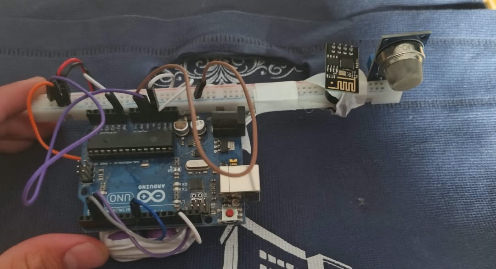

# 🚀 IoT Gas Leakage Monitoring and Alarm System
Smart Gas Leakage Monitoring and Alarm System using Arduino Uno, ESP-01 WiFi Module, MQTT Protocol, and Node-RED Dashboard.

---

## 🎓 Project Overview
This project is a senior graduation project for the 4th Year, Artificial Intelligence program, Sana'a Community College.
- **Supervisor:** Dr. Abdulrahman Al-Awadhi
- **Team Members:**
  - Ahmed Saeed Al-Hakimi
  - Ayham Al-Bukhiti
  - Mohammed Al-Aswad
  - Abdulhakim Howaida
  - Omar Shamsan
  - Mahdi Mahdi

---

## 📸 System Visuals & Screenshots

### 1. Hardware Assembly & Circuit Setup
The physical prototype integrating the Arduino Uno, ESP-01 WiFi module, MQ Gas Sensor, and Buzzer powered by dual Lithium-ion batteries:

### 2. Node-RED Dashboard & Automation Flow
The interactive Node-RED flow responsible for receiving MQTT data, monitoring thresholds, and dispatching real-time alerts:

---

## 🛠️ How It Works & Technical Implementation

### 1. Architecture & Signal Flow
1. **Sensing:** The MQ Gas Sensor continuously measures the combustible gas concentration and sends an analog signal to the Arduino Uno (`A0`).
2. **Wireless Transmission:** The Arduino processes the reading and transmits it via the ESP-01 WiFi module using the lightweight **MQTT protocol** (Mosquitto Broker).
3. **Dashboard & Monitoring:** Node-RED subscribes to the topic (`ahmed/gas_sensor/level`), visualizes the data on gauges, and evaluates threshold conditions.
4. **Instant Alerts:** If a leak is detected, the system automatically triggers local buzzers and sends remote alerts (Telegram/Email).

### 2. Key Engineering Challenges & Solutions
- **Static IP Stability (`192.168.137.1`):** To prevent connection drops caused by dynamic IP changes, the system leverages a Windows Mobile Hotspot configuration, securing a permanent, static gateway (`192.168.137.1`) for the MQTT broker.
- **Concurrency & Manual Override (`manualOverride`):** We implemented a non-blocking loop using `millis()` and a boolean state variable (`manualOverride`) to seamlessly synchronize automatic threshold alarms with remote manual overrides from the dashboard without blocking message queues.

---

## 📂 Repository Structure
- `Arduino/`: Contains the complete C++ source code (`.ino`) for the Arduino Uno.
- `Node-RED/`: Contains the exported JSON flow configuration (`.json`) for the dashboard.
- `Images/`: Contains the hardware setup and live dashboard screenshots.
