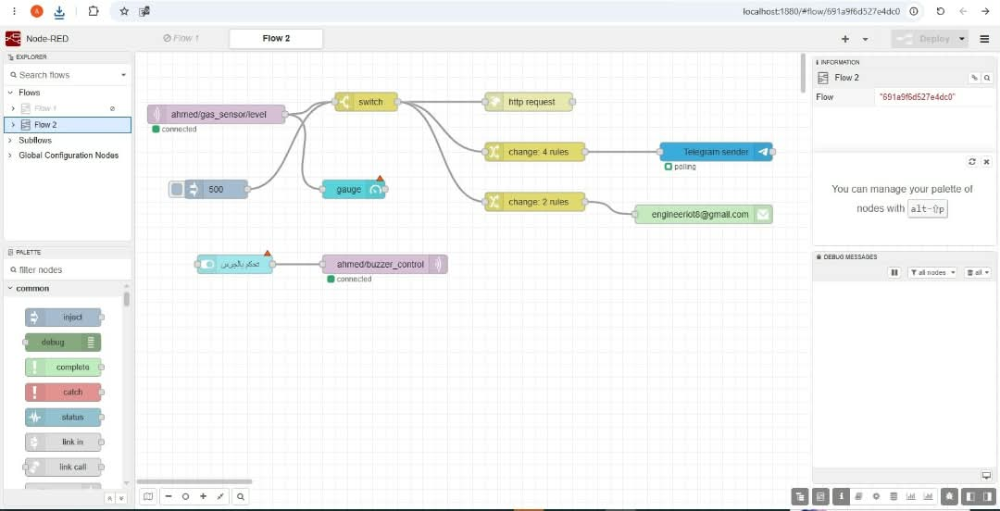

# 🚀 IoT Gas Leakage Monitoring and Alarm System
Smart Gas Leakage Monitoring and Alarm System using Arduino Uno, ESP-01 WiFi Module, Local MQTT Protocol, and Node-RED Dashboard.

---

## 🎓 Project Overview
This project is a senior graduation project for the 4th Year, Artificial Intelligence program, Sana'a Community College.
- **Supervisor:** Dr. Abdulrahman Al-Awadhi
- **Team Members:**
  - Ahmed Saeed Al-Hakimi
  - Ayham Al-Bukhiti
  - Mohammed Al-Aswad
  - Abdulhakim Howaida
  - Omar Shamsan
  - Mahdi Mahdi

---

## 📸 System Visuals & Screenshots

### 1. Hardware Assembly & Circuit Setup
The physical prototype integrating the Arduino Uno, ESP-01 WiFi module, MQ Gas Sensor, and Buzzer powered by dual Lithium-ion batteries:

### 2. Node-RED Dashboard (User Interface)
The interactive web-based dashboard created via Node-RED, allowing users to monitor live gas levels through gauges and remotely control the buzzer via a manual override switch:

### 3. Node-RED Automation Flow & Logic
The visual programming logic handling incoming MQTT data, threshold evaluations, and dispatching real-time notifications to external APIs (Email, Telegram, WhatsApp):

---

## 🛠️ How It Works & Technical Implementation

### 1. Architecture & Signal Flow
1. **Sensing:** The MQ Gas Sensor continuously measures combustible gas concentrations and sends an analog signal (`A0`) to the Arduino Uno.
2. **Local Wireless Transmission (MQTT):** The Arduino processes the reading and transmits it via the ESP-01 WiFi module. We utilized a **Local MQTT Broker (Mosquitto)** to ensure ultra-fast, offline-capable communication without relying on external cloud latency.
3. **Dashboard & Monitoring:** Node-RED subscribes to the MQTT topic (`ahmed/gas_sensor/level`), visualizes the data on the dashboard gauges, and continuously evaluates risk conditions.

### 2. Key Engineering Challenges & Solutions
- **Static IP Stability (`192.168.137.1`):** To prevent connection drops caused by dynamic IP changes on standard WiFi networks, the system leverages a Windows Mobile Hotspot configuration. This secures a permanent, static gateway (`192.168.137.1`) on the standard MQTT port (`1883`) for the local broker, ensuring 100% connection stability.
- **Concurrency & Manual Override (`manualOverride`):** We implemented a non-blocking loop in the Arduino code using `millis()` and a boolean state variable (`manualOverride`). This allows the system to seamlessly synchronize automatic threshold alarms with remote manual overrides from the dashboard without blocking the MQTT message queue.

### 3. Multi-Channel Alert System
To ensure maximum safety, the system is engineered to dispatch instant notifications across multiple platforms the moment a gas leak is detected:
- **Email Alerts:** Integrated Node-RED's Email node to send emergency emails detailing the leak directly to the user's inbox.
- **Telegram Bot:** Created a dedicated Telegram Bot via `BotFather` and connected it to Node-RED using the Telegram API nodes, allowing instant push notifications to a designated chat.
- **WhatsApp Integration:** Leveraged the `CallMeBot API` to send automated WhatsApp messages. The system triggers a pre-configured URL (e.g., `https://api.callmebot.com/whatsapp.php?phone=[NUMBER]&text=DANGER+Gas+Leak+Detected&apikey=[KEY]`) via an HTTP Request node in Node-RED, delivering critical alerts straight to the user's phone.

---

## 📂 Repository Structure
- `Arduino/`: Contains the complete C++ source code (`.ino`) for the Arduino Uno & ESP-01.
- `Node-RED/`: Contains the exported JSON flow configuration (`.json`) containing the dashboard UI and notification logic.
- `Images/`: Contains the hardware setup and live dashboard screenshots.
